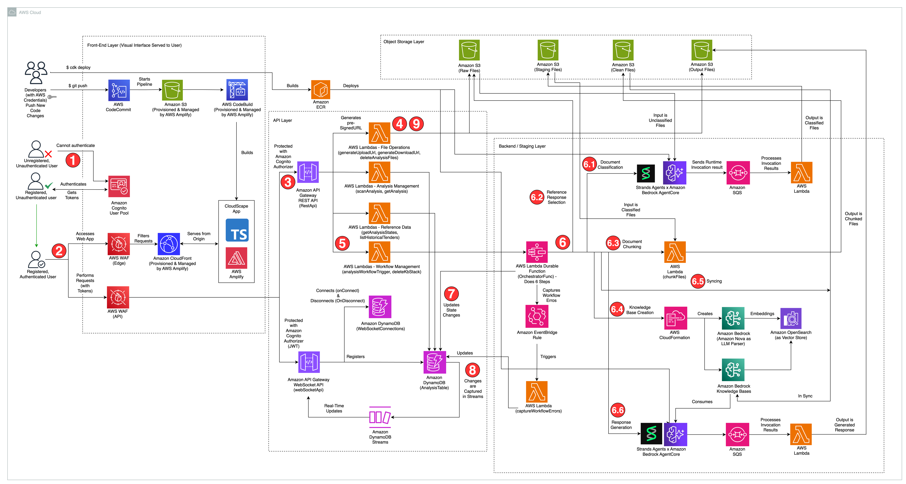

# Intelligent Tender Response Generator

A generative-AI sample that analyzes tender / RFP (Request for Proposal) documents and
drafts structured responses, built on **Amazon Bedrock AgentCore**, **Amazon Bedrock
Knowledge Bases**, and a fully serverless **AWS CDK** backend with a **React
(Cloudscape)** web client.

The entire stack — backend *and* front-end — deploys with `cdk deploy --all`. CDK
packages the React app, seeds a CodeCommit repository with it, and AWS Amplify builds and
hosts the front-end from that repository. No GitHub token or pre-existing repository is
required.

> **Disclaimer:** This is sample code intended for demonstration and prototyping. It is
> not production-ready as-is. Review the [Security](#security) section and harden the
> application before using it with sensitive data or production workloads.

---

## Table of contents

- [Architecture](#architecture)
- [User journey](#user-journey)
- [Repository layout](#repository-layout)
- [Prerequisites](#prerequisites)
- [Deploy](#deploy)
- [Create a login user](#create-a-login-user)
- [Using the application](#using-the-application)
- [Local front-end development](#local-front-end-development)
- [Configuration](#configuration)
- [Cost](#cost)
- [Clean up](#clean-up)
- [Security](#security)
- [License](#license)

---

## Architecture



> Also available as [`docs/architecture.svg`](docs/architecture.svg) (vector). The editable
> source is [`docs/architecture.drawio`](docs/architecture.drawio) — open with
> [diagrams.net](https://app.diagrams.net/).

The diagram is organised into functional layers — a **Front-End Layer**, an **API Layer**,
an **Object Storage Layer**, and a **Backend / Staging Layer**. The numbered badges trace a
single analysis request end to end (the badge numbers below match the diagram):

1. The user accesses the web app. The React (Cloudscape) front-end is hosted by **AWS
   Amplify**, which builds it from a CDK-seeded **CodeCommit** repository (via CodeBuild/ECR)
   and serves it over its managed CloudFront distribution behind **AWS WAF (Edge)**.
2. The user **authenticates** with **Amazon Cognito** (OIDC / JWT) and obtains tokens.
3. Authenticated requests reach the **API Gateway REST API** (protected by the Cognito
   authorizer, an API key, and **AWS WAF (API)**); a **WebSocket API** carries real-time
   updates.
4. The **File Operations** Lambdas (`generateUploadUrl`, …) issue a **pre-signed URL** and
   the user **uploads** tender files to **Amazon S3 (Raw Files)**.
5. The **Workflow Management** Lambdas (`analysisWorkflowTrigger`, `deleteKbStack`) start
   the analysis and trigger the orchestrator.
6. The **durable orchestrator Lambda** (`OrchestratorFunc`) runs the workflow as six
   sequential steps:
   1. **Document classification** — the Document Classifier **Strands** agent on **Amazon
      Bedrock AgentCore** categorizes each uploaded file (results returned via **Amazon
      SQS**); raw files move to the staging bucket.
   2. **Reference-response selection** — selects a past response to use as a style
      reference, based on the chosen reference tender.
   3. **Document chunking** — splits large PDFs (staging bucket → clean files bucket).
   4. **Knowledge Base creation** — provisions the **Amazon Bedrock Knowledge Base**
      (parsing/embeddings via **Amazon Bedrock** Nova), backed by **Amazon OpenSearch
      Serverless** as the vector store (only if it does not already exist).
   5. **Data-source syncing** — ingests the clean files into the Knowledge Base.
   6. **Response generation** — the Response Generator **Strands** multi-agent drafts the
      response, writing results to **Amazon S3 (Output Files)**.
7. The workflow **updates state** in **Amazon DynamoDB (AnalysisTable)** as it progresses.
8. AnalysisTable **changes are captured in DynamoDB Streams**, fanned out to connected
   clients over the **WebSocket API** for live progress (an **EventBridge** rule captures
   workflow errors). Connections are tracked in **DynamoDB (WebSocketConnections)**.
9. When generation completes, the **File Operations** Lambda (`generateDownloadUrl`) issues
   a pre-signed URL so the user can **download** the generated response from **Amazon S3**.

The application is split into four CDK stacks:

| Stack | Responsibility |
| ----- | -------------- |
| **CoreStack** | S3 buckets (raw / staging / clean / output / historic / multimodal), IAM roles, and the OpenSearch Serverless collection used by Bedrock Knowledge Bases. |
| **AgentCoreStack** | Two Amazon Bedrock AgentCore runtimes — a **Document Classifier** and a **Response Generator** (multi-agent) — packaged as container images built via CodeBuild. |
| **FrontEndStack** | Cognito user pool, REST API + WebSocket API, API key/usage plan, AWS WAF, a CodeCommit repository seeded with the React source, and an AWS Amplify app that builds and hosts it (with the backend endpoints injected as build-time environment variables). |
| **InfraStack** | The Lambda functions and DynamoDB table that orchestrate the analysis workflow, plus the API Gateway resource/method wiring. |

## User journey

From the web UI, a user:

1. Signs in (Amazon Cognito) and creates a new tender response.
2. Uploads the tender project and requirement **PDF** files, optionally picking a contract
   type and a past response to use as a style reference.
3. Starts response generation and watches the six analysis steps progress in real time
   (classify → select reference → chunk → create / sync Knowledge Base → generate).
4. Previews and downloads the generated response artifacts when the workflow completes.

The durable orchestrator runs those six steps server-side; see the
[Architecture](#architecture) diagram above for the full request flow.

## Repository layout

```text
.
├── infra/         AWS CDK (Python) application — all backend + front-end infrastructure
│   ├── app.py                 CDK app entry point (defines the four stacks)
│   ├── project_config.json    Stack names and model IDs/ARNs
│   ├── infra/                 Stack definitions + reusable CDK constructs
│   └── assets/                Lambda function code and AgentCore agent code
└── front-end/     React (Create React App) + Cloudscape Design System web client
    └── src/                   Application source; reads backend wiring from REACT_APP_* env
```

## Prerequisites

- An AWS account and credentials with permission to deploy the resources above.
- [AWS CLI](https://docs.aws.amazon.com/cli/latest/userguide/getting-started-install.html) v2, configured (`aws configure`).
- [Node.js](https://nodejs.org/) 18+ and npm (to build the front-end).
- [Python](https://www.python.org/) 3.12+ and `pip` (the deployed Lambda functions and
  AgentCore runtimes target Python 3.14; Docker handles their bundling).
- [AWS CDK](https://docs.aws.amazon.com/cdk/v2/guide/getting_started.html) v2 (`npm install -g aws-cdk`).
- [Docker](https://www.docker.com/) running locally — the CDK bundles Python Lambda
  layers/functions and builds the AgentCore container images.
- **Amazon Bedrock model access** enabled in your target region for the models referenced
  in [`infra/project_config.json`](infra/project_config.json) and
  [`infra/infra/agentcore_stack.py`](infra/infra/agentcore_stack.py) (Claude and Amazon
  Nova families). Request access in the Bedrock console under **Model access**.

> This sample defaults to **us-east-1**. Make sure the models you enable are available in
> the region you deploy to.

## Deploy

The CDK app resolves the target account and region from the `CDK_DEFAULT_ACCOUNT` /
`CDK_DEFAULT_REGION` environment variables (set automatically from your AWS CLI
credentials/region), or from `-c account=... -c region=...` context flags. Make sure your
region is set to one where the Bedrock models you enabled are available — this sample
defaults to **us-east-1**.

```bash
# (optional) pin the region explicitly for this shell
export AWS_DEFAULT_REGION=us-east-1

# 1. Set up the CDK Python environment
cd infra
python3 -m venv .venv
source .venv/bin/activate          # Windows: .venv\Scripts\activate.bat
pip install -r requirements.txt

# 2. Bootstrap the account/region once (if you have not used CDK here before)
cdk bootstrap

# 3. Deploy everything
cdk deploy --all
```

You do **not** build the front-end yourself: CDK zips the `front-end/` source, seeds a
CodeCommit repository with it, and AWS Amplify builds and hosts the app (auto-building on
each push to the repo's `main` branch).

When the deployment finishes:

- **`FrontEndStack.AmplifyAppDomain`** — the Amplify domain of the web app. The live URL is
  the **`main` branch** URL, i.e. `https://main.<AmplifyAppDomain-without-scheme>` (for
  example `https://main.d1234abcd.amplifyapp.com`).
- **`FrontEndStack.FrontendRepositoryCloneUrl`** — the CodeCommit repo Amplify builds from;
  pushing to its `main` branch triggers a rebuild.
- **`FrontEndStack.UserPoolId`** — the Amazon Cognito user pool ID (used to create login
  users; see below).

### Trigger the first Amplify build

When Amplify's source is a CodeCommit repository, the **first** build is **not** started
automatically by the deploy — you must kick it off once (subsequent pushes to the repo
auto-build). Start it from the console (Amplify → the app → `main` branch → **Run build**),
or via the CLI:

```bash
APP_ID=$(aws amplify list-apps \
  --query "apps[?name=='TenderResponseGenerator'].appId" --output text)

aws amplify start-job --app-id "$APP_ID" --branch-name main --job-type RELEASE
```

The build runs `npm install && npm run build` and deploys; allow a few minutes, then open
the `main` branch URL.

### Allow the Amplify domain in Cognito

The Cognito app client ships with `http://localhost:3000` callback/sign-out URLs. After the
first deploy, add your Amplify `main` URL so hosted-UI sign-in can redirect back to it
(otherwise login fails with a redirect-mismatch error). In the Cognito console, add
`https://main.<your-amplify-domain>` to **Allowed callback URLs** and
`https://main.<your-amplify-domain>/login` to **Allowed sign-out URLs** for the
`TenderResponseGenerator` app client.

## Create a login user

Self sign-up is **disabled**, so you must create at least one user before you can sign in.
The user pool signs in by **email**, and the password must satisfy the pool's policy
(minimum 8 characters, with an uppercase letter, a digit, and a symbol).

```bash
# 1. Get the user pool ID from the stack output (or copy it from the deploy output)
USER_POOL_ID=$(aws cloudformation describe-stacks \
  --stack-name FrontEndStack \
  --query "Stacks[0].Outputs[?OutputKey=='UserPoolId'].OutputValue" \
  --output text)

# 2. Create the user (email as username). --message-action SUPPRESS skips the
#    Cognito invitation email; email_verified=true lets the user sign in directly.
aws cognito-idp admin-create-user \
  --user-pool-id "$USER_POOL_ID" \
  --username "demo@example.com" \
  --user-attributes Name=email,Value="demo@example.com" Name=email_verified,Value=true \
  --message-action SUPPRESS

# 3. Set a permanent password (so there is no forced "change password" prompt on first login)
aws cognito-idp admin-set-user-password \
  --user-pool-id "$USER_POOL_ID" \
  --username "demo@example.com" \
  --password 'TempPass123!' \
  --permanent
```

You can now sign in to the web app with `demo@example.com` / `TempPass123!`.

> These are throwaway demo credentials for testing only. Use a strong, unique password for
> anything beyond a quick demo, and delete the user (`aws cognito-idp admin-delete-user`)
> when you are done.

## Using the application

1. Open the Amplify `main` branch URL (from the `AmplifyAppDomain` output).
2. Sign in with the Cognito user you created above.
3. Create an analysis, upload one or more tender PDFs, and start the workflow.
4. Watch live progress, then download the generated response artifacts.

## Local front-end development

Yes — you can run the UI on `http://localhost:3000` against the **deployed** backend. The
app reads its backend configuration from build-time `REACT_APP_*` environment variables
(Amplify injects these during its build); locally you provide them via a `.env.local` file.

`localhost:3000` (and `https://localhost:3000`) is already an allowed Cognito callback and
the REST API allows all CORS origins, so a locally served front-end can talk to the
deployed backend with no extra setup.

```bash
cd front-end
cp .env.example .env.local
# fill in .env.local with the six values below, then:
npm install
npm start                       # opens http://localhost:3000
```

Obtain the six values from the deployed stack (replace the region if you changed it):

```bash
REGION=us-east-1
POOL_ID=$(aws cloudformation describe-stacks --stack-name FrontEndStack \
  --query "Stacks[0].Outputs[?OutputKey=='UserPoolId'].OutputValue" --output text)
CLIENT_ID=$(aws cognito-idp list-user-pool-clients --user-pool-id "$POOL_ID" \
  --query 'UserPoolClients[0].ClientId' --output text)
API_URL=$(aws cloudformation describe-stacks --stack-name FrontEndStack \
  --query "Stacks[0].Outputs[?OutputKey=='WebAppPatternRestApiEndpoint872E135F'].OutputValue" --output text)

echo "REACT_APP_COGNITO_AUTHORITY=https://cognito-idp.$REGION.amazonaws.com/$POOL_ID"
echo "REACT_APP_USER_POOL_CLIENT_ID=$CLIENT_ID"
echo "REACT_APP_COGNITO_DOMAIN=https://tender-response-generator.auth.$REGION.amazoncognito.com"
echo "REACT_APP_API_URL=${API_URL%/}/dev"
echo "REACT_APP_WSS_URL=<WebSocket URL — see the WebSocketApi stage in API Gateway, e.g. wss://<id>.execute-api.$REGION.amazonaws.com/dev>"
# The API key value (not exposed by CloudFormation):
KEY_ID=$(aws apigateway get-api-keys --name-query api-key --query 'items[0].id' --output text)
echo "REACT_APP_API_KEY=$(aws apigateway get-api-key --api-key "$KEY_ID" --include-value --query 'value' --output text)"
```

> Sign in with a Cognito user you created in [Create a login user](#create-a-login-user).
> The API key is a throttling/usage key (not an auth secret); it is delivered to the
> browser by design.

## Configuration

- **Stack names and model IDs/ARNs** are defined in
  [`infra/project_config.json`](infra/project_config.json).
- **AgentCore model IDs** are set in
  [`infra/infra/agentcore_stack.py`](infra/infra/agentcore_stack.py).
- **Front-end backend wiring** is injected into the Amplify build as `REACT_APP_*`
  environment variables (Cognito, REST API, WebSocket, and API key), set by the
  `WebAppPattern` construct — you do not edit them by hand. The API key value (which
  CloudFormation does not expose directly) is resolved at deploy time via a custom resource
  and injected as `REACT_APP_API_KEY`.

## Cost

This sample provisions billable AWS resources. There is no free tier for several of
them, so you will incur charges while the stacks are deployed. The main cost drivers are:

- **Amazon Bedrock** — per-token charges for the Claude and Amazon Nova models used by the
  AgentCore runtimes and Knowledge Base (the largest variable cost, driven by usage).
- **Amazon OpenSearch Serverless** — the vector collection backing the Knowledge Base bills
  for a minimum of OCUs whenever it exists, so it accrues cost even when idle.
- **AWS Amplify hosting, API Gateway, Lambda, DynamoDB, S3, CodeCommit** — pay-per-use;
  small for light testing.
- **Amazon Cognito, AWS WAF** — low fixed/usage-based costs.

Actual cost depends on your region, request volume, and how long the stacks stay up. Use
the [AWS Pricing Calculator](https://calculator.aws/) to estimate for your usage, and run
`cdk destroy --all` (see below) when you are done to stop ongoing charges.

## Clean up

```bash
cd infra
source .venv/bin/activate
cdk destroy --all
```

All S3 buckets in this sample use `RemovalPolicy.DESTROY` with auto-delete, so they are
emptied and removed on `cdk destroy`. Double-check the account afterward for any retained
resources (e.g. CloudWatch log groups).

## Security

This is sample/prototyping code. Before using it beyond experimentation:

- Self sign-up is disabled and the Cognito user pool enforces a password policy and
  advanced security; review MFA and consider enabling it.
- The Amplify-hosted front-end sits behind AWS WAF (managed rule sets); the REST API stage
  is also protected by a regional WAF.
- S3 buckets block public access, enforce SSL, and use S3-managed encryption.
- IAM policies in a few places use broad permissions for sample simplicity — scope them
  down for production.
- **Front-end dependencies:** the React app is built with Create React App
  (`react-scripts`). Runtime dependencies are kept patched, but `npm audit` reports
  advisories in CRA's **build-time** tooling (webpack, jest, eslint, svgo, workbox, etc.).
  These run only during `npm run build`/test and are **not part of the shipped browser
  bundle**; they cannot be fully resolved without ejecting CRA or migrating the build
  tooling. Review and, for production, consider migrating to a maintained build tool.
- See [CONTRIBUTING.md](CONTRIBUTING.md) for how to report a security issue.

## License

This library is licensed under the MIT-0 License. See the [LICENSE](LICENSE) file.
